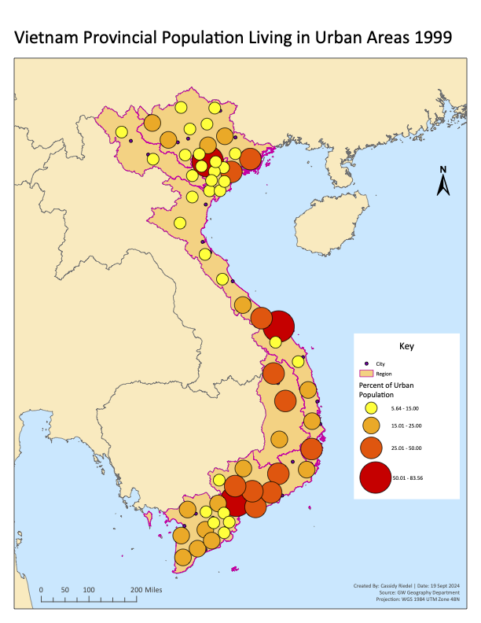
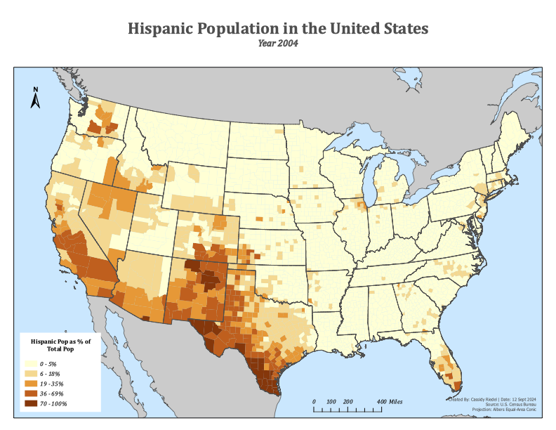
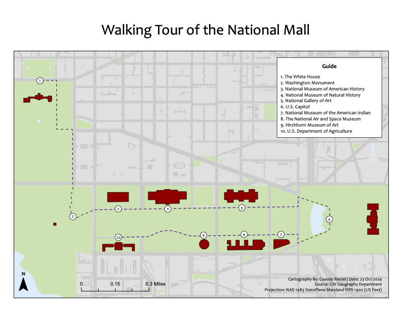
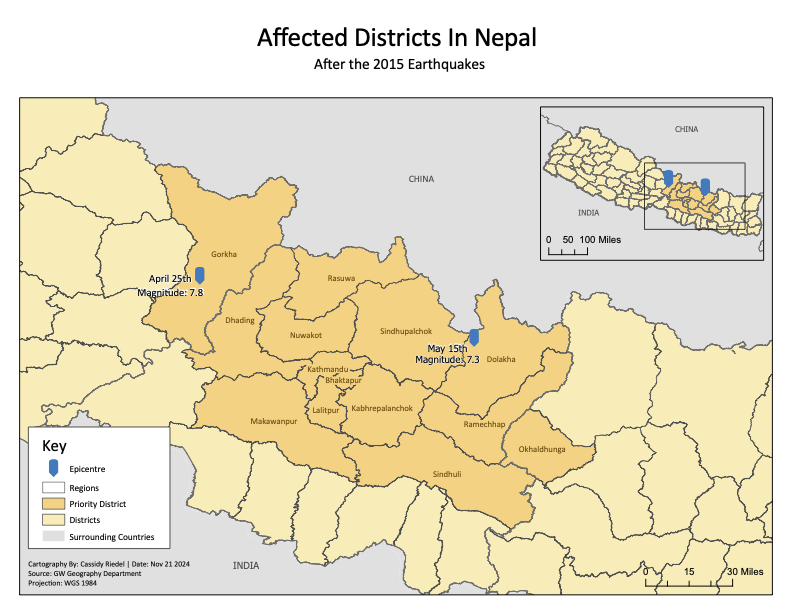

# ArcGIS Map Portfolio (PNG Gallery)

This repository showcases a small portfolio of **four maps created in ArcGIS**.  
Each map is displayed below as a **PNG preview** so it renders directly on GitHub.
---

## Map Gallery

### 1) Vietnam — Urban Population (1999)


**Goal:** Visualize how Vietnam’s urban population is distributed across administrative areas in 1999.

**How I made it in ArcGIS:**
- Imported Vietnam administrative boundaries and the 1999 urban population table.
- Used Join (admin name/code) to attach population values to the boundary layer.
- Styled the layer with Graduated Colors (choropleth) and tuned some class breaks for readability.
- Added map elements (title, legend, scale bar, north arrow) in Layout View and exported as PNG.

---

### 2) United States — Hispanic Population (2004)


**Goal:** Compare Hispanic population across U.S. regions using a clear thematic map.

**How I made it in ArcGIS:**
- Loaded U.S. boundary features and the 2004 Hispanic population dataset.
- Joined demographic attributes to the geography and checked for missing/mismatched records.
- Mapped the data as a choropleth using Graduated Colors.
- Chose normalized values when appropriate (percent/ratio) to avoid misleading comparisons from the raw counts.
- Finalized labeling/legend formatting and exported the layout as PNG.

---

### 3) Washington, D.C. — National Mall Walking Tour


**Goal:** Create a clean navigation/reference map showing a walking route and key stops around the National Mall.

**How I made it in ArcGIS:**
- Selected an appropriate opensource basemap (readable at walking-tour scale).
- Created the route as a line feature (digitized path / route tool workflow).
- Added points of interest as a separate layer with clear symbols and labels.
- Designed the layout with visual hierarchy (route emphasis, subtle basemap, consistent typography), then exported as PNG.

---

### 4) Nepal — Earthquake Affected Districts


**Goal:** Highlight districts impacted by the Nepal earthquake and make affected areas immediately identifiable.

**How I made it in ArcGIS:**
- Loaded Nepal district boundaries and an “affected districts” attribute dataset.
- Joined the attribute data to districts and established the affected/not-affected classification.
- Styled affected districts with a high-contrast fill and used a muted style for non-affected areas.
- Added contextual layers (e.g., boundaries/labels) and finished the map in Layout View, exporting as PNG.

---

## Folder Structure
```text
.
└── images/
    ├── arcgis_01.png
    ├── arcgis_02.png
    ├── arcgis_03.png
    └── arcgis_04.png
